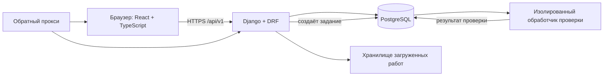

# Архитектура образовательной платформы

Статус: проектное предложение для хакатона. Документ описывает границы фронтенда и бэкенда и служит общей точкой согласования до начала параллельной разработки.

## 1. Цель и требования кейса

Платформа должна поддерживать три роли: ученик, куратор и администратор. Ученик проходит курс и сдаёт работы; куратор отвечает на вопросы по шагам и проверяет работы вручную; администратор собирает, редактирует и публикует курсы. В курсе должны быть теория и контрольные вопросы, а отдельные задания могут требовать работы в Scratch или Minecraft Education.

Курс состоит из шагов разных типов. Нужны автоматическая проверка тестов и ответов, ручная проверка файла или ссылки, понятный прогресс и объяснимый рейтинг. Реальных персональных данных в демо нет. Встроенные видеосвязь, оплата, CRM и общий мессенджер в объём не входят.

Для демонстрации команда готовит собственный синтетический курс и синтетические учётные записи. Дизайн-токены и графические материалы брендбука подключаются к фронтенду после подготовки.

## 2. Предлагаемый стек

- **Фронтенд:** React + TypeScript. Отдельное одностраничное приложение для экранов ученика, куратора и администратора.
- **Бэкенд:** Python + Django 5.2 LTS + Django REST Framework (DRF). DRF предоставляет сериализаторы и инструменты для API; доменная логика остаётся в приложении Django.
- **База данных:** PostgreSQL.
- **Развёртывание:** Docker Compose на одном Linux-сервере: веб/API, PostgreSQL, фоновый обработчик проверок и обратный прокси.
- **Авторизация:** сессионная авторизация Django. На стенде фронтенд и API публикуются под одним доменом (`/` и `/api/v1/`); в локальной разработке запросы фронтенда проксируются к API.

React выбран для явного разделения задач фронтенда и API. Если в команде никто не готов вести React/TypeScript, до старта реализации лучше заменить его на Django templates и оставить те же границы модулей и доменные правила. Не следует одновременно поддерживать оба способа рендеринга.

## 3. Схема приложения



Всё приложение — один модульный Django-бэкенд. Проверка ученического кода выделена в отдельный процесс/контейнер, потому что ей нужен отдельный уровень изоляции. Отдельные микросервисы для пользователей, курсов и прогресса на хакатоне не нужны.

## 4. Границы фронтенда

Фронтенд отвечает за отображение экранов, формы и пользовательское состояние. Он не решает, правильный ли ответ, сколько баллов начислить, кому доступна работа и какая версия курса назначена ученику: это проверяет бэкенд.

Предлагаемая структура:

```text
frontend/src/
  app/                 маршруты, общая оболочка, авторизация
  features/auth/       вход и текущая роль
  features/student/    каталог, прохождение, сдача, прогресс
  features/curator/    ученики, очередь работ, вопросы
  features/admin/      курсы, шаги, публикация, назначения
  features/steps/      отображение шагов по type_key
  shared/api/          клиент API и общие типы ответов
  shared/ui/           кнопки, формы, таблицы, сообщения
```

Для каждого типа шага фронтенд регистрирует компонент прохождения. Например, `theory` показывает материал, `quiz.single_choice` показывает вопрос с вариантами, `algorithm.python` — поле кода, а `artifact.scratch` и `artifact.minecraft` — задание и форму для отправки результата или подтверждающих материалов.

## 5. Границы бэкенда

Бэкенд проверяет права доступа, валидирует входные данные, хранит состояние курса и попыток, запускает правила проверки и возвращает прогресс.

```text
backend/
  config/              настройки, корневые URL, ASGI/WSGI
  apps/accounts/       пользователи, роли, назначения
  apps/courses/        курсы, версии, шаги, публикация
  apps/learning/       записи на курс, попытки, сдачи
  apps/grading/        авто-проверка, очередь кода, результаты
  apps/mentoring/      ручная очередь, отзывы, вопросы по шагам
  apps/progress/       прогресс, баллы, признаки отставания
```

Доменные операции (например, публикация версии и принятие работы) выполняются отдельными сервисными функциями внутри соответствующего приложения. HTTP-обработчики DRF должны оставаться тонкими: разобрать запрос, проверить разрешения, вызвать операцию, вернуть ответ.

## 6. Основные сущности и правила данных

| Сущность | Назначение |
|---|---|
| `User` | Пользователь, роль и синтетическое отображаемое имя |
| `Course` | Название, описание, диапазон классов и владелец |
| `CourseRevision` | Неизменяемый опубликованный выпуск курса или текущий черновик |
| `StepRevision` | Шаг конкретной версии: ключ типа, порядок, контент, настройки и баллы |
| `Enrollment` | Ученик, назначенная версия курса и закреплённый куратор |
| `Submission` | Попытка ученика: ответ/файл/ссылка, статус и время |
| `Review` | Решение куратора и комментарий по ручной проверке |
| `StepQuestion` | Вопрос ученика по конкретному шагу и ответ куратора |

Публикация создаёт новую версию курса. Уже начатые записи остаются привязаны к прежней версии, чтобы прошлые попытки и результаты не меняли смысл. Новые назначения получают последнюю опубликованную версию. Перевод текущей записи на новую версию можно добавить отдельно, если это подтвердят организаторы.

Прогресс выводится из принятых шагов, а не хранится как независимое число, которое может разойтись с попытками. Баллы за принятый шаг начисляются один раз независимо от того, проверил его алгоритм или куратор. Фронтенд показывает разбивку баллов по шагам.

## 7. Расширяемые типы шагов

У каждого типа есть стабильный `type_key`, версия схемы данных, правила валидации, форма редактирования для администратора, отображение для ученика и обработчик проверки. Пример ключей:

- `theory` — текст/материал и отметка о прохождении;
- `quiz.single_choice` — вопрос с вариантами и немедленной проверкой;
- `answer.exact` — ответ строкой с проверкой;
- `algorithm.python` — исходный код и набор тестов; обработчик запускает тесты, а ученик получает результат в том же сценарии сдачи;
- `artifact.scratch` — задание с блоковой конструкцией и ожидаемым результатом; ученик изучает или выполняет его в Scratch и отправляет ссылку, файл или снимок результата на ручную проверку;
- `artifact.minecraft` — задание для выполнения в Minecraft Education; ученик отправляет ссылку, описание, файл или снимок результата на ручную проверку.

Для Scratch и Minecraft Education платформа хранит инструкции и результаты сдачи; прямое встраивание самих сред в платформу не предполагается базовой архитектурой. Формат материалов и сдачи нужно сверить с организаторами.

Настройки шага хранятся в структурированных JSON-полях, но обязательно валидируются по схеме конкретного типа. Правильные ответы и скрытые тесты никогда не отправляются в браузер ученика. Добавление типа требует добавить его обработчик в бэкенде и соответствующий компонент/форму на фронтенде; общие таблицы курсов и попыток переписывать не требуется.

## 8. Потоки работы

### Администратор

1. Создаёт курс и черновик.
2. Добавляет шаги разных типов и меняет их порядок; курс включает теорию и контрольный вопрос.
3. Публикует версию курса.
4. Назначает ученика и куратора.
5. Редактирует опубликованный курс через новый черновик и новую публикацию.

### Ученик

1. Видит назначенные курсы, прогресс и следующий рекомендуемый шаг.
2. Отвечает на контрольный вопрос, отправляет код или выполняет практическое задание в Scratch/Minecraft Education и прикладывает результат.
3. Получает результат автоматической проверки в рамках той же сдачи либо статус ожидания куратора.
4. Видит комментарий к возврату, повторно сдаёт работу и видит изменение прогресса после принятия.
5. Может задать вопрос в контексте конкретного шага; общий чат не создаётся.

### Куратор

1. Видит только закреплённых за ним учеников.
2. Открывает очередь ручных проверок.
3. Принимает работу или возвращает её с комментарием.
4. Отвечает на вопросы по шагам и видит признаки застоя: долго нет завершённого шага, повторяются неудачные попытки, возвращённая работа не исправлена.

Статусы сдачи: `queued`, `checking`, `pending_review`, `accepted`, `returned`, `error`. Повторная сдача создаёт новую попытку; история старых попыток и отзывов остаётся доступной.

## 9. API-контракт для параллельной работы

Все маршруты имеют префикс `/api/v1/`. До реализации фронтенда и эндпоинтов следует согласовать `docs/api-contract.md`: формат успешного ответа, формат ошибки, пагинацию, авторизацию, роли и примеры JSON для основных сценариев.

Предварительные группы маршрутов:

| Контур | Примеры операций |
|---|---|
| Авторизация | `POST /auth/login`, `POST /auth/logout`, `GET /auth/me` |
| Ученик | `GET /student/courses`, `GET /enrollments/{id}`, `POST /steps/{id}/submissions`, `GET /enrollments/{id}/progress`, `POST /steps/{id}/questions` |
| Куратор | `GET /curator/students`, `GET /curator/reviews`, `POST /submissions/{id}/review`, `POST /questions/{id}/answer` |
| Администратор | CRUD черновиков курсов/шагов, `POST /courses/{id}/publish`, назначение учеников и кураторов |

Это карта для обсуждения с участником, который проектирует эндпоинты; до фиксации контракта маршруты и формы JSON могут меняться. Каждый эндпоинт проверяет роль и связь пользователя с курсом на сервере.

## 10. Запуск кода и загруженные файлы

Проверка Python-кода — обязательный сценарий кейса, а не необязательное расширение. API создаёт задание проверки в PostgreSQL; отдельный обработчик запускает фиксированный образ Python для конкретной версии задания, выполняет тесты, записывает результат и меняет статус попытки. Проверка может выполняться асинхронно, но интерфейс должен показать результат сразу в потоке сдачи — например, опрашивая статус задания до завершения. Этот сценарий нужно включить в первый рабочий вертикальный срез.

Запущенный учеником код должен работать без сети, с ограничением CPU, памяти, времени, процессов и размера входа/выхода; без привилегий, секретов приложения и доступа к базе. Docker-сокет, если он нужен обработчику для запуска контейнеров, не монтируется в веб/API-контейнер. Это отдельный риск и отдельная задача реализации: код студентов нельзя выполнять через `exec` внутри процесса Django.

Загружаемые работы хранятся отдельно от исполняемого кода приложения. Для файлов задаются лимиты размера и разрешённые форматы; скачивание идёт через проверку доступа к попытке, а не по публичному пути в файловой системе.

## 11. Развёртывание и конфигурация

Docker Compose запускает API, фронтенд/обратный прокси, PostgreSQL и обработчик проверок. База и загруженные работы используют постоянные тома. Пароли и ключи задаются через `.env`, в репозиторий добавляется только `.env.example` без секретов. Для публичного адреса стенда нужны настроенный домен/HTTPS или другой согласованный способ защищённого доступа.

Основной вариант — VPS. Компьютер участника допустим как стенд, если он остаётся включённым и сеть доступна во время защиты. Все учётные записи и учебные данные — синтетические.

## 12. Порядок интеграции

До параллельной реализации нужно согласовать контракт API, схему типов шагов, статусы сдачи и примеры JSON для ключевых сценариев. Фронтенд и бэкенд используют эти контракты как границу интеграции. Дизайн-токены и графические материалы подключаются к общей теме интерфейса после подготовки брендбука. Каждая вертикальная часть должна оставаться запускаемой и проверяемой до слияния.

## 13. Git и слияния

Использовать GitFlow с постоянными ветками `main` и `develop`:

- `main` — версия, готовая к защите или выпуску. Напрямую в неё не коммитить.
- `develop` — общая интеграционная ветка текущей разработки.
- `feature/<задача>` — новая функция или документация; базовая ветка и цель PR — `develop`.
- `release/<версия>` — финальная проверка и подготовка релиза; после проверки вливается в `main`, затем результат синхронизируется обратно в `develop`.
- `hotfix/<задача>` — срочное исправление для `main`; после выпуска исправление также вливается в `develop`.

Не заводить постоянные ветки `backend`, `frontend` или `core`: они долго расходятся и усложняют слияние. Делить работу на короткие задачи и заранее договариваться о владельце и границах файлов. Например: `feature/student-course-view`, `feature/manual-review`, `feature/api-contract`, `feature/compose`.

Перед началом параллельной реализации нужен интеграционный коммит: каркас проекта, структура каталогов, запуск локально, Compose-конфигурация, базовые модели/контракты и синтетические демоданные. Миграциями базы управляет один назначенный человек; конкурирующие миграции сначала согласуются, затем объединяются.

Каждый участник работает в своей ветке или worktree. Перед PR нужно подтянуть актуальную целевую ветку, проверить изменения и запустить затронутые проверки. PR в `develop` просматривает хотя бы один участник команды; `main` обновляется только через release/hotfix PR. Конфликты по общим файлам и миграциям решать до слияния, назначив одного владельца изменения.

## 14. Минимальный сценарий для защиты

1. Администратор собирает и публикует курс с теорией, контрольным вопросом, Python-задачей и практическими заданиями Scratch/Minecraft Education.
2. Администратор назначает тестового ученика и куратора.
3. Ученик выполняет автоматические шаги и сдаёт проект на ручную проверку.
4. Куратор возвращает проект с комментарием; ученик сдаёт исправленную работу; куратор принимает её.
5. Ученик видит обновлённые прогресс и баллы; куратор видит, где ученик задержался.
6. Администратор меняет курс и публикует новую версию, при этом прежняя попытка остаётся привязана к исходной версии.

## 15. Решения, которые ещё нужно подтвердить

- Есть ли участник, готовый владеть React/TypeScript интерфейсом; если нет, переключиться на Django templates до начала фронтенд-разработки.
- Подтвердят ли организаторы Python как язык для проверки по тестам. Базовый план — Python.
- Должны ли уже зачисленные ученики автоматически переходить на новую версию курса.
- Какой формат задания и сдачи ожидают организаторы для Scratch/Minecraft Education и достаточно ли ссылки, файла или снимка результата без прямой интеграции со средами.
- Выбрать VPS или компьютер участника после оценки доступности, сети и времени настройки.

## Ссылки на официальную документацию

- [Django 5.2](https://docs.djangoproject.com/en/5.2/) — модели, формы, авторизация, шаблоны и администрирование.
- [Django REST Framework: Quickstart](https://www.django-rest-framework.org/tutorial/quickstart/) — сериализаторы, API-представления и маршрутизация.
- [React: Learn](https://react.dev/learn) — компонентный подход к пользовательскому интерфейсу.
- [Docker Compose в production](https://docs.docker.com/compose/how-tos/production/) — запуск приложения на одном сервере.
- [Ограничения ресурсов Docker](https://docs.docker.com/engine/containers/resource_constraints/) и [сеть Compose](https://docs.docker.com/compose/how-tos/networking/) — основа ограничений обработчика кода.
