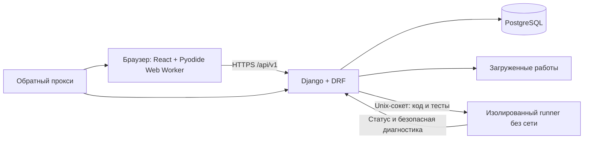

# Архитектура образовательной платформы

Статус: архитектурная основа MVP. Официальный Python-runner реализован в ветке `codex/python-server-runner`; до merge в `develop` это состояние ветки, а не релиза. Оставшиеся разрывы и задачи — в [аудите от 25.09](docs/case-compliance-and-task-plan-2026-09-25.md).

## 1. Цель и требования кейса

Платформа должна поддерживать три роли: ученик, куратор и администратор. Ученик проходит курс и сдаёт работы; куратор отвечает на вопросы по шагам и проверяет работы вручную; администратор собирает, редактирует и публикует курсы. В курсе должны быть теория и контрольные вопросы, а отдельные задания могут требовать работы в Scratch или Minecraft Education.

Курс состоит из шагов разных типов. Нужны автоматическая проверка тестов и ответов, ручная проверка файла или ссылки, понятный прогресс и объяснимый рейтинг. Реальных персональных данных в демо нет. Встроенные видеосвязь, оплата, CRM и общий мессенджер в объём не входят.

Для демонстрации уже есть синтетический курс и синтетические учётные записи. [Базовый учебный пакет и официальный брендбук](docs/organizer/README.md) получены и размещены в проекте; 3 курса, 9 модулей и 30 шагов ещё нужно перенести в модель и рабочий интерфейс. Исходный DOCX с ответами опубликован в открытом Git по решению владельца. Текущее соответствие кейсу отражено в [сверке](docs/current-gap-analysis.md).

## 2. Предлагаемый стек

- **Фронтенд:** React + TypeScript. Отдельное одностраничное приложение для экранов ученика, куратора и администратора.
- **Бэкенд:** Python + Django 5.2 LTS + Django REST Framework (DRF). DRF предоставляет сериализаторы и инструменты для API; доменная логика остаётся в приложении Django.
- **База данных:** PostgreSQL.
- **Развёртывание:** Docker Compose для веб/API, PostgreSQL, обратного прокси и отдельного Python-runner. Pyodide в браузере используется для локальной самопроверки.
- **Авторизация:** сессионная авторизация Django. На стенде фронтенд и API публикуются под одним доменом (`/` и `/api/v1/`); в локальной разработке запросы фронтенда проксируются к API.

React выбран для явного разделения задач фронтенда и API. Если в команде никто не готов вести React/TypeScript, до старта реализации лучше заменить его на Django templates и оставить те же границы модулей и доменные правила. Не следует одновременно поддерживать оба способа рендеринга.

## 3. Схема приложения



Локальная самопроверка получает один открытый пример и выполняет код в Web Worker;
она не создаёт попытку. При официальной отправке браузер передаёт только код.
Django выбирает тесты из опубликованной версии и обращается к runner по
Unix-сокету. Runner запускает каждый тест в отдельном подпроцессе с лимитами
CPU, wall-clock, памяти, вывода, файлов и процессов. Контейнер не подключён
к сети, БД, media и Docker socket; ребёнок запускается с непривилегированным UID.
Синхронная оценка ограничена 45 секундами на попытку; очередь оставлена на
будущее. Django не выполняет ученический код в своём процессе и не принимает
клиентский stdout как доказательство правильности.

## 4. Границы фронтенда

Фронтенд отвечает за отображение экранов, формы и пользовательское состояние. Он не решает, правильный ли ответ, сколько баллов начислить, кому доступна работа и какая версия курса назначена ученику: это проверяет бэкенд.

Предлагаемая структура:

```text
frontend/src/
  app/                 маршруты, общая оболочка, авторизация
  features/auth/       вход и текущая роль
  features/student/    каталог, прохождение, сдача, прогресс
  features/curator/    ученики, очередь работ, вопросы
  features/admin/      курсы, шаги, публикация, назначения
  features/steps/      отображение шагов по type_key
  shared/api/          клиент API и общие типы ответов
  shared/ui/           кнопки, формы, таблицы, сообщения
```

Для каждого типа шага фронтенд регистрирует компонент прохождения. Например, `theory` показывает материал, `quiz.single_choice` показывает вопрос с вариантами, `algorithm.python` — поле кода, а `artifact.scratch` и `artifact.minecraft` — задание и форму для отправки результата или подтверждающих материалов.

## 5. Границы бэкенда

Бэкенд проверяет права доступа, валидирует входные данные, хранит состояние курса и попыток, запускает правила проверки и возвращает прогресс.

```text
backend/
  config/              настройки, корневые URL, ASGI/WSGI
  apps/accounts/       пользователи, роли, назначения
  apps/courses/        курсы, версии, шаги, публикация
  apps/learning/       записи на курс, попытки, сдачи
  apps/grading/        авто-проверка, очередь кода, результаты
  apps/mentoring/      ручная очередь, отзывы, вопросы по шагам
  apps/progress/       прогресс, баллы, признаки отставания
```

Доменные операции (например, публикация версии и принятие работы) выполняются отдельными сервисными функциями внутри соответствующего приложения. HTTP-обработчики DRF должны оставаться тонкими: разобрать запрос, проверить разрешения, вызвать операцию, вернуть ответ.

## 6. Основные сущности и правила данных

| Сущность | Назначение |
|---|---|
| `User` | Пользователь, роль и синтетическое отображаемое имя |
| `Course` | Название, описание, диапазон классов и владелец |
| `CourseRevision` | Неизменяемый опубликованный выпуск курса или текущий черновик |
| `StepRevision` | Шаг конкретной версии: ключ типа, порядок, контент, настройки и баллы |
| `Enrollment` | Ученик, назначенная версия курса и закреплённый куратор |
| `Submission` | Попытка ученика: ответ/файл/ссылка, статус и время |
| `Review` | Решение куратора и комментарий по ручной проверке |
| `StepQuestion` | Вопрос ученика по шагу в конкретном назначении и ответ закреплённого куратора |

Публикация создаёт новую версию курса. Уже начатые записи остаются привязаны к прежней версии, чтобы прошлые попытки и результаты не меняли смысл. Новые назначения получают последнюю опубликованную версию. Перевод текущей записи на новую версию можно добавить отдельно, если это подтвердят организаторы.

Прогресс выводится из принятых шагов, а не хранится как независимое число, которое может разойтись с попытками. Баллы за принятый шаг начисляются один раз независимо от того, проверил его алгоритм или куратор. В первом рабочем срезе принятый шаг даёт полные `max_score`, остальные попытки — ноль. `completion_percent = floor(100 × принятые шаги / все шаги)`, `rating_percent = floor(100 × заработанные баллы / доступные баллы)`. Публикация пустого курса или курса с нулевой суммой баллов запрещена. Фронтенд показывает обе величины и разбивку по шагам; правила подробно зафиксированы в [сверке с кейсом](docs/case-alignment.md).

## 7. Расширяемые типы шагов

У каждого типа есть стабильный `type_key`, версия схемы данных, правила валидации, форма редактирования для администратора, отображение для ученика и обработчик проверки. Пример ключей:

- `theory` — текст/материал и явное действие ученика «Прочитал»;
- `quiz.single_choice` — вопрос с вариантами и немедленной проверкой;
- `answer.exact` — ответ строкой с проверкой;
- `algorithm.python` — исходный код и набор тестов; браузерный Web Worker проверяет открытый пример, а серверный runner исполняет все тесты для официального зачёта;
- `artifact.scratch` — задание с блоковой конструкцией и ожидаемым результатом; ученик изучает или выполняет его в Scratch и отправляет ссылку, файл или снимок результата на ручную проверку;
- `artifact.minecraft` — задание для выполнения в Minecraft Education; ученик отправляет ссылку, описание, файл или снимок результата на ручную проверку.

Для Scratch и Minecraft Education платформа хранит инструкции и результаты сдачи; прямое встраивание самих сред в платформу не предполагается базовой архитектурой. Формат материалов и сдачи нужно сверить с организаторами.

Настройки шага хранятся в структурированных JSON-полях и валидируются по типу. Закрытые тесты не отправляются в браузер через API; локальная кнопка получает только намеренно открытый пример. Оригинальный DOCX опубликован в Git вместе с эталонами, поэтому ответы из него сами по себе не являются секретом. Для оценки, устойчивой к подгонке, нужны дополнительные серверные тесты вне публичного пакета.

## 8. Потоки работы

### Администратор

1. Создаёт курс и черновик.
2. Добавляет шаги разных типов и меняет их порядок; курс включает теорию и контрольный вопрос.
3. Публикует версию курса.
4. Назначает ученика и куратора.
5. Редактирует опубликованный курс через новый черновик и новую публикацию.

### Ученик

1. Видит назначенные курсы, прогресс и следующий рекомендуемый шаг.
2. Отвечает на контрольный вопрос, отправляет код или выполняет практическое задание в Scratch/Minecraft Education и прикладывает результат.
3. Получает результат автоматической проверки в рамках той же сдачи либо статус ожидания куратора.
4. Видит отдельно неверное автоматическое решение, технический сбой и возврат куратора с комментарием; повторно сдаёт работу и видит изменение прогресса после принятия.
5. Может задать вопрос в контексте конкретного шага; общий чат не создаётся.

### Куратор

1. Видит только закреплённых за ним учеников.
2. Открывает очередь ручных проверок.
3. Принимает работу или возвращает её с комментарием.
4. Отвечает на вопросы по шагам и видит объяснимые признаки застоя: 72 часа без зачёта, две неверные попытки на одном шаге за 24 часа или возврат без пересдачи 24 часа. Эти пороги — начальная гипотеза для демо.

Статусы сдачи: `queued`, `checking`, `pending_review`, `accepted`, `incorrect`, `returned`, `error`. `incorrect` означает неуспешную автоматическую проверку, `returned` — решение куратора, `error` — технический сбой. Повторная сдача создаёт новую попытку; история старых попыток и отзывов остаётся доступной. На шаге с активной проверкой повторная сдача блокируется; принятое задание повторно не оценивается.

## 9. API-контракт для параллельной работы

Все маршруты имеют префикс `/api/v1/`. До реализации фронтенда и эндпоинтов следует согласовать `docs/api-contract.md`: формат успешного ответа, формат ошибки, пагинацию, авторизацию, роли и примеры JSON для основных сценариев.

Предварительные группы маршрутов:

| Контур | Примеры операций |
|---|---|
| Авторизация | `POST /auth/login`, `POST /auth/logout`, `GET /auth/me` |
| Ученик | `GET /student/courses`, `GET /enrollments/{id}`, `POST /steps/{id}/submissions`, `GET /enrollments/{id}/progress`, `POST /steps/{id}/questions` |
| Куратор | `GET /curator/students`, `GET /curator/reviews`, `POST /submissions/{id}/review`, `POST /questions/{id}/answer` |
| Администратор | CRUD черновиков курсов/шагов, `POST /courses/{id}/publish`, назначение учеников и кураторов |

Это карта для обсуждения с участником, который проектирует эндпоинты; до фиксации контракта маршруты и формы JSON могут меняться. Каждый эндпоинт проверяет роль и связь пользователя с курсом на сервере.

## 10. Запуск кода и загруженные файлы

Проверка Python-кода — обязательный сценарий кейса. Ветка `codex/python-server-runner`
разделяет локальную самопроверку и официальный зачёт: `GET .../python-sample`
выдаёт один открытый пример; `POST .../submissions` принимает только `code`.
Локальный Pyodide поставляется из npm-пакета вместе с фронтендом. Runner
выполняет присланный код в отдельном контейнере без внешней сети, измеряет
лимиты независимо от браузера и возвращает `accepted`, `incorrect` либо
`error`. Техническая недоступность runner даёт HTTP 503 без новой попытки.

У браузера нет надёжного лимита всей памяти WebAssembly; локальный результат
является подсказкой ученику. Время, память и правильность официальной сдачи
определяет только сервер. Выполнение пока синхронное: при росте нагрузки
потребуется очередь и отдельный неблокирующий статус `queued/checking`.

Загружаемые работы хранятся отдельно от исполняемого кода приложения. Для файлов задаются лимиты размера и разрешённые форматы; скачивание идёт через проверку доступа к попытке, а не по публичному пути в файловой системе.

## 11. Развёртывание и конфигурация

Docker Compose запускает API, фронтенд/обратный прокси, PostgreSQL и изолированный runner. База и загруженные работы используют постоянные тома. Пароли и ключи задаются через `.env`, в репозиторий добавляется только `.env.example` без секретов. Для публичного адреса стенда нужны настроенный домен/HTTPS или другой согласованный способ защищённого доступа.

Основной вариант — VPS. Компьютер участника допустим как стенд, если он остаётся включённым и сеть доступна во время защиты. Все учётные записи и учебные данные — синтетические.

## 12. Порядок интеграции

Контракт API, схема типов шагов, статусы сдачи и примеры JSON зафиксированы. Контракт модулей и импорта пакета ещё требует реализации. При изменении контракта frontend и backend обновляются согласованно. Официальные дизайн-токены получены и должны быть подключены к рабочему интерфейсу. Каждая новая вертикальная часть должна оставаться запускаемой и проверяемой до слияния.

## 13. Git и слияния

Использовать GitFlow с постоянными ветками `main` и `develop`:

- `main` — версия, готовая к защите или выпуску. Напрямую в неё не коммитить.
- `develop` — общая интеграционная ветка текущей разработки.
- `feature/<задача>` — новая функция или документация; базовая ветка и цель PR — `develop`.
- `release/<версия>` — финальная проверка и подготовка релиза; после проверки вливается в `main`, затем результат синхронизируется обратно в `develop`.
- `hotfix/<задача>` — срочное исправление для `main`; после выпуска исправление также вливается в `develop`.

Не заводить постоянные ветки `backend`, `frontend` или `core`: они долго расходятся и усложняют слияние. Делить работу на короткие задачи и заранее договариваться о владельце и границах файлов. Например: `feature/student-course-view`, `feature/manual-review`, `feature/api-contract`, `feature/compose`.

Перед началом параллельной реализации нужен интеграционный коммит: каркас проекта, структура каталогов, запуск локально, Compose-конфигурация, базовые модели/контракты и синтетические демоданные. Миграциями базы управляет один назначенный человек; конкурирующие миграции сначала согласуются, затем объединяются.

Каждый участник работает в своей ветке или worktree. Перед PR нужно подтянуть актуальную целевую ветку, проверить изменения и запустить затронутые проверки. PR в `develop` просматривает хотя бы один участник команды; `main` обновляется только через release/hotfix PR. Конфликты по общим файлам и миграциям решать до слияния, назначив одного владельца изменения.

## 14. Минимальный сценарий для защиты

1. Администратор собирает и публикует курс с теорией, контрольным вопросом, задачей с точным ответом, Python-задачей и практическими заданиями Scratch/Minecraft Education; каждый тип реально проходит в демо.
2. Администратор назначает тестового ученика и куратора.
3. Ученик выполняет автоматические шаги и сдаёт проект на ручную проверку.
4. Куратор возвращает проект с комментарием; ученик сдаёт исправленную работу; куратор принимает её.
5. Ученик видит обновлённые прогресс и баллы; куратор видит, где ученик задержался.
6. Администратор меняет курс и публикует новую версию, при этом прежняя попытка остаётся привязана к исходной версии.

## 15. Решения, которые ещё нужно подтвердить

- Как представить отдельный педагогический тип «Проект» и Scratch с числовым ответом без потери исходного типа; какие доказательства обязательны для каждого реального шага и где хранить приватные критерии куратора.
- Проверить на целевом хосте пропускную способность синхронного Python-runner; при необходимости добавить очередь и ограничение запросов.
- Выбрать VPS или компьютер участника после проверки доступности HTTPS-стенда во время защиты.

React/TypeScript, Python из полученного пакета и привязка существующих назначений к
неизменяемой версии курса уже выбраны. Владелец также подтвердил правило §04
кейса: для публикации каждого курса нужны теория и контрольный вопрос; это
правило проверяется сервером.

## Ссылки на официальную документацию

- [Django 5.2](https://docs.djangoproject.com/en/5.2/) — модели, формы, авторизация, шаблоны и администрирование.
- [Django REST Framework: Quickstart](https://www.django-rest-framework.org/tutorial/quickstart/) — сериализаторы, API-представления и маршрутизация.
- [React: Learn](https://react.dev/learn) — компонентный подход к пользовательскому интерфейсу.
- [Docker Compose в production](https://docs.docker.com/compose/how-tos/production/) — запуск приложения на одном сервере.
- [Ограничения ресурсов Docker](https://docs.docker.com/engine/containers/resource_constraints/) и [сеть Compose](https://docs.docker.com/compose/how-tos/networking/) — основа ограничений обработчика кода.
